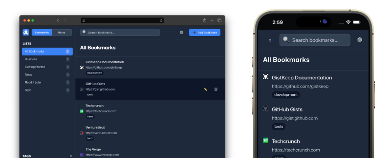

# GistKeep

> GistKeep is an open source bookmark and notes app that stores your library in your own GitHub Gist.

Fully client-side with no app-owned backend or hosted database. Your bookmarks and notes live in Markdown in your own Github Gist, which makes them portable, inspectable, versioned, and easy to back up. [Try it here](https://chrisdiana.github.io/gistkeep/app.html)

<p align="center">
  <a href="https://chrisdiana.github.io/gistkeep/">
    
  </a>
</p>

## Features

- Plain Markdown storage
- Built-in bookmarklet for saving links from anywhere
- Categories, tags, search, and notes
- Theme support
- Optional content encryption

## How It Works

1. Open the app and connect it to a GitHub Gist using a personal access token.
2. GistKeep reads and writes your bookmark and notes data directly to that gist.
3. Use the web app or bookmarklet to save and organize links.
4. Reopen the app later to browse, edit, search, and manage your library.

## Getting Started

### 1. Create a GitHub personal access token

Create a token with the minimum access needed to read and update the gist you want to use.

### 2. Run the app locally

Because this is a static app, any simple local web server will work.

```bash
python3 -m http.server 8080
```

Then open:

```text
http://localhost:8080/app.html
```

### 3. Configure GistKeep

On first launch, provide:

- `GitHub Username or Gist ID`
- `GitHub Personal Access Token`
- an optional encryption key if you want token protection and encrypted content

If you do not provide an encryption key, the token can still be stored locally, but it will not be encrypted.

## Bookmarklet

GistKeep includes a bookmarklet generator inside the app.

After setup:

1. Open Settings
2. Find the bookmarklet section
3. Drag `Save to GistKeep` to your bookmarks bar, or copy the generated code manually

The bookmarklet opens GistKeep with the current page URL and title prefilled so you can save links quickly.


## Security Notes

### Token storage

GistKeep can encrypt the locally stored GitHub token with a user-supplied passphrase. Without that passphrase, the token is stored locally without encryption.

### Encryption note

GistKeep currently uses `CryptoJS.AES.encrypt(...)` with a user-supplied passphrase for local token protection and optional gist content encryption.

This means:

- Data is AES-encrypted with a passphrase-derived key
- The current implementation relies on CryptoJS/OpenSSL-style defaults

This is reasonable for casual privacy and personal use, but it should not be treated as state-of-the-art protection for high-value secrets. The real security still depends heavily on choosing a strong, unique encryption key.

### Gist privacy

Unlisted GitHub gists are not the same thing as strongly private storage. Anyone with the URL can access the gist unless the content itself is encrypted.

## Tradeoffs

GistKeep is intentionally simple, and that comes with tradeoffs:

- It rewrites managed files when saving changes
- Very large libraries are not the ideal use case
- GitHub Gist is the storage model, so GitHub availability and gist behavior matter
- Sharing and privacy depend on how you configure and use your gist

For normal personal collections, these tradeoffs are often worth it. For very large libraries or heavy collaboration, a conventional backend-backed app may be a better fit.

## Open Source

GistKeep is intended to be easy to inspect, self-host, and modify. It is a plain static app with no framework or build pipeline required.

## Contributing

Contributions are welcome.

If you want to contribute:

1. Open an issue or start a discussion for bugs, UX changes, or larger ideas
2. Keep changes focused and easy to review
3. Test the affected flow locally by serving the app and checking `app.html`
4. If you change storage behavior, bookmarklet behavior, or security-related logic, include clear notes in your PR

## License

See [LICENSE](./LICENSE).
